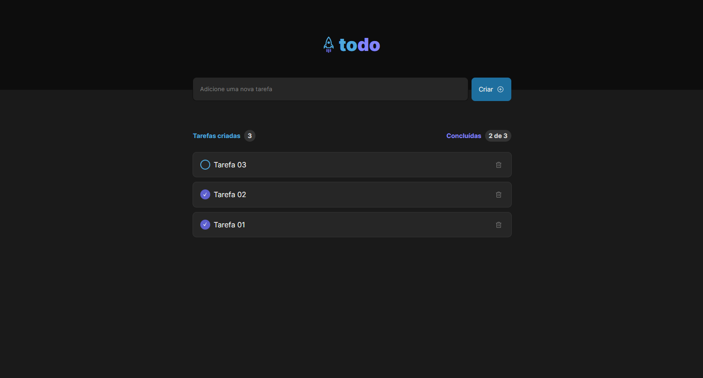

# Todo List

Esse código foi construído utilizando ReactJS (Vite) e Typescript. Seu propósito é permitir o cadastro de tarefas de forma muito simples
através de um formulário de input único. Essa aplicação contém apenas uma tela e para cada item que for adicionado, atualizado ou removido, a lista é persistida dentro da sessão do navegador, ou seja, mesmo após fechar o site ou atualizar a aba de navegação, os dados não serão perdidos.

Tela:

---

Tecnologias utilizadas:

- REACTJS
- TYPESCRIPT
- VITE
- PHOSPHOR ICONS
- CSS
- FIGMA
